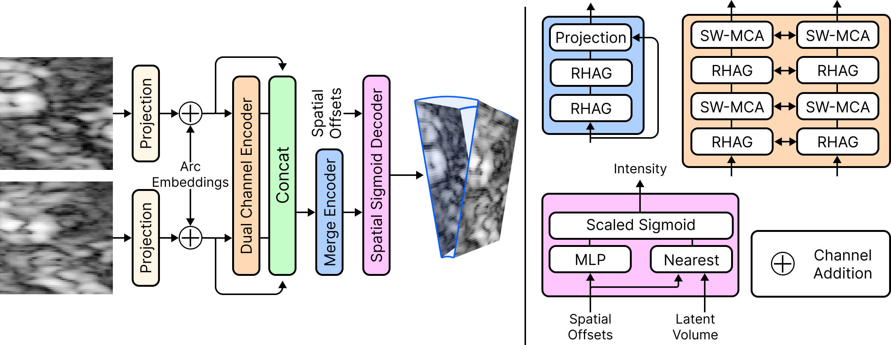

# Geometry-Aware Implicit Neural Reconstruction of Oblique Micro-Ultrasound Scans

Official PyTorch implementation of *"Geometry-Aware Implicit Neural Reconstruction of Oblique Micro-Ultrasound Scans"* (paper link: TBD).

---

### Abstract

Micro-ultrasound is a new modality for accurate, low-cost prostate cancer imaging, but its acquisition produces oblique slices that do not align with axial MRI or histopathology. This geometric mismatch complicates interpretation and prevents direct registration to histopathology, which is necessary to map ground-truth cancer outlines onto micro-ultrasound for training machine learning models for automated cancer detection.
We address this challenge with a geometry-aware reconstruction framework that converts oblique micro-ultrasound slices into axial 3D volumes. Our method includes: (i) a coordinate-based sampling scheme that uses cylindrical geometry to accurately map each voxel into Cartesian space, and (ii) a generalized implicit neural representation that models the continuous intensity field between slices, preserving high-frequency speckle texture that traditional interpolation blurs. The reconstructed volumes achieve a 9% relative SSIM improvement over a coordinate-matched trilinear baseline while maintaining ultrasound-specific texture and boundary detail. This framework produces high-quality axial micro-ultrasound volumes suitable for reliable histopathology registration and for creating pathology-informed datasets to train cancer detection models.

### Network Architecture

Our model uses a Dual-Path Hybrid Attention Transformer (HAT) augmented with Arc Length Embeddings to encode physical acquisition geometry.

<p align="center">
  
</p>

## Installation

```bash
git clone <repo-url>
cd geomINR
pip install -e .
```

Training uses the **Muon** optimizer from `torch.optim`, which requires **torch >= 2.12** (you may need the PyTorch nightly / dev wheel index). Weights & Biases logging is optional and disabled by default.

Optional extras:

```bash
pip install -e ".[vit]"   # ViT-S/2 baseline data pipeline (NVIDIA DALI)
```

## Dataset

Our micro-ultrasound dataset is not publicly available. You can build your own dataset from micro-ultrasound DICOM scans with `data/data_build.py`. The training pipeline expects the processed dataset under `data/dataset/{train,val,test}`, and the held-out test split is listed in `data/test_ids.txt`.

## Configuration

Each run is a single, self-contained YAML under `configs/runs/`, loaded with OmegaConf (not Hydra). The reference recipe is `configs/runs/canonical.yaml`; the ablations are `configs/runs/abl_*.yaml`. Any field can be overridden inline:

```bash
--set train.num_epochs=50 wandb.enabled=false
```

W&B is disabled by default (`wandb.enabled: false`); set it to `true` and adjust `wandb.project` to enable logging.

## Usage

#### Training (Distributed Data Parallel)

```bash
torchrun --standalone --nproc_per_node=2 scripts/train.py --config configs/runs/canonical.yaml
```

#### Evaluation

```bash
python scripts/eval.py --config configs/runs/canonical.yaml
```

#### Inference (volumetric reconstruction → NIfTI)

```bash
python scripts/inference.py --config configs/runs/canonical.yaml
```

#### No-data smoke check

```bash
python scripts/smoke_check.py
```

## Baselines

The per-scene optimization baselines (ImplicitVol, UltraNeRF) used in the paper live under `geominr/baselines/`. Fit, evaluate, and reconstruct with:

```bash
python scripts/fit_baselines.py        --help
python scripts/eval_baselines.py       --help
python scripts/inference_baselines.py  --help
```

A ViT-S/2 patch-interpolation reference baseline is provided via `scripts/train-vit.py` / `scripts/eval-vit.py` with `configs/runs/vit_baseline.yaml`.

## Repository structure

```
geominr/       core package (config, models/{HAT, ViT, utils}, baselines)
scripts/       train / eval / inference entry points (+ baselines, ViT)
configs/runs/  self-contained run configs (canonical + ablations)
data/          data loaders and dataset-build utilities
docs/adr/      architecture decision records
```

## Citation

See [`CITATION.cff`](CITATION.cff). The BibTeX entry and DOI will be added on publication.

## Acknowledgments

The encoder builds on [HAT: Hybrid Attention Transformer](https://github.com/XPixelGroup/HAT).

## License

See [`LICENSE`](LICENSE). **The license is not yet finalized** — the intended model is source-available for non-commercial use, with commercial licensing available on request.
